*Quick links :*
[Home](/README.md) - [Scotland](SCOTLAND.md) - [Watson Studio](STUDIO.md) - [**Visual Recognition Model**](VISRECO.md) - [Test and Deploy](VRMTEST.md)
***

## Lab Objectives

In this lab you will create a Visual Recognition model in a Watson Studio Project.  You will learn:

- How to work within a new Watson Studio Project
- How to create a Visual Recognition model

### Watson Studio Projects

Projects are your workspace to organize your resources, such as assets like data, collaborators, and analytic tools like notebooks and models.
The first step is to add Assets to your Watson Studio Project

#### Add Assets to your Watson Studio Project
- Click on the **Assets** tab

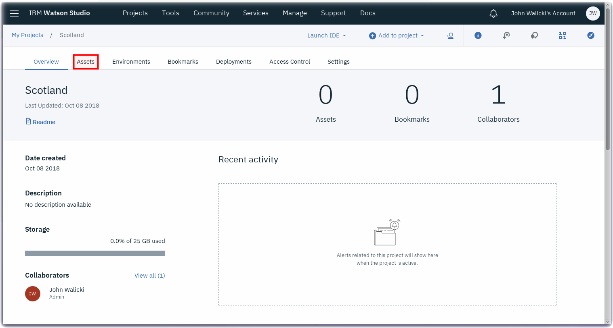

#### Create a New Visual Recognition model
- Click on **New Visual Recognition model**

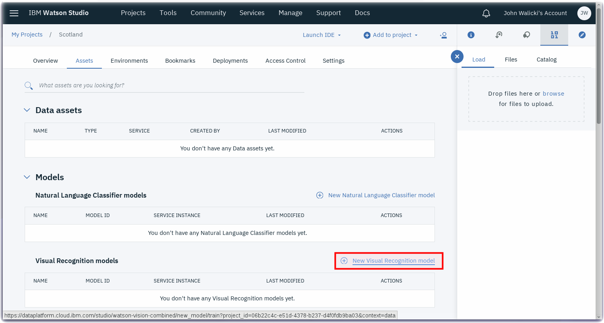

#### Provision a new Watson Visual Recognition Service instance
- Your project needs to be associated with a Watson Visual Recognition Service instance
- Click on the **click here** link in the popup to provision a new service

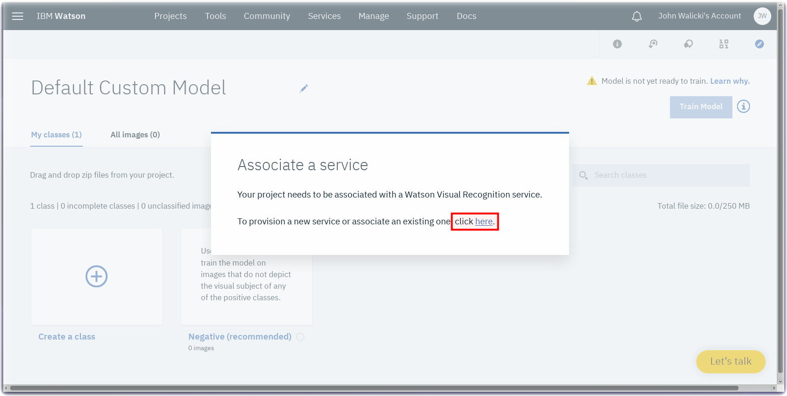

#### Create a Watson Visual Recognition Service
- Select the **Lite** plan and note the features
- Scroll to the bottom and click on the **Create** button

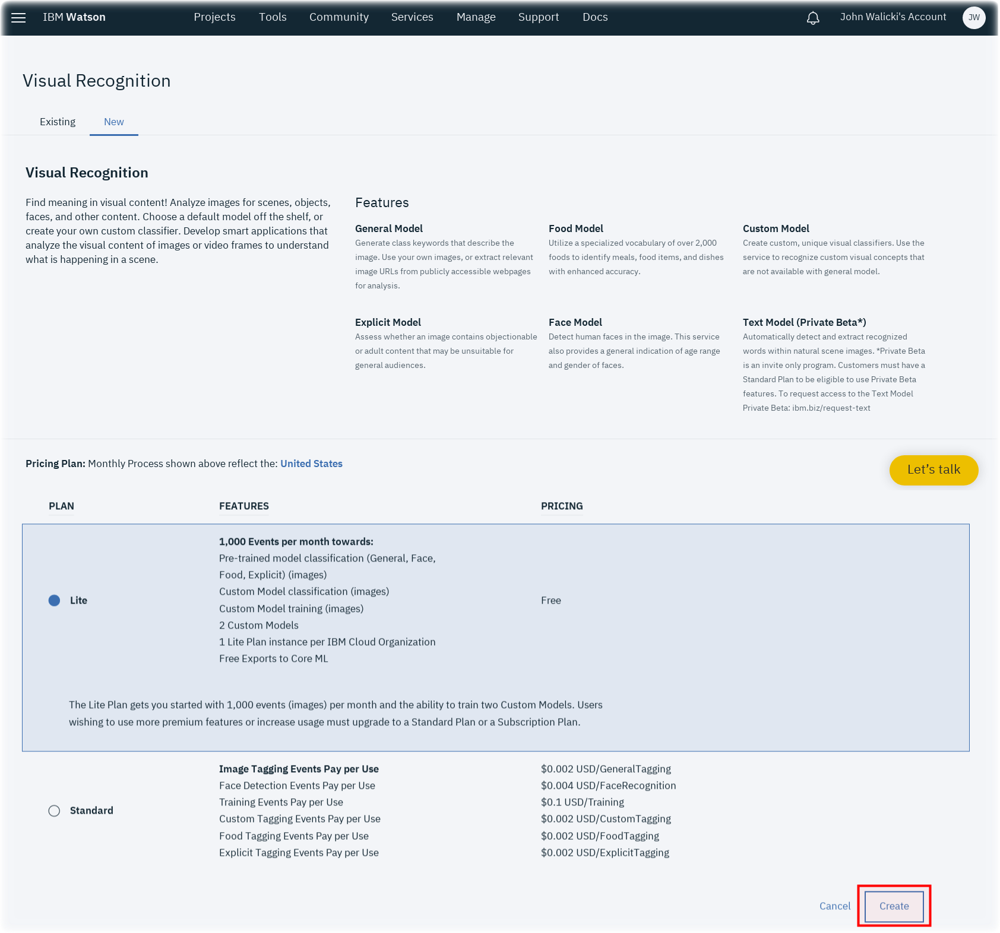

#### Rename Visual Recognition Model
- The **Default Custom Model** name is not descriptive so let's rename it
- Click on the **pencil** icon to edit the name

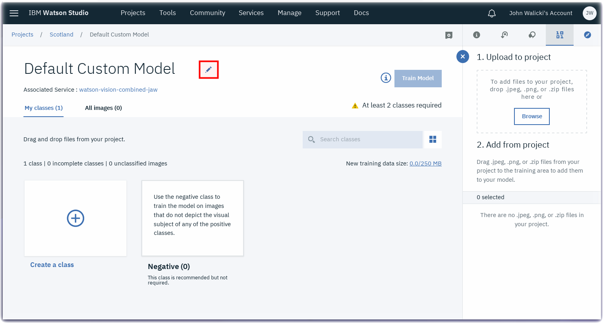

- Rename the model to **Scotland**

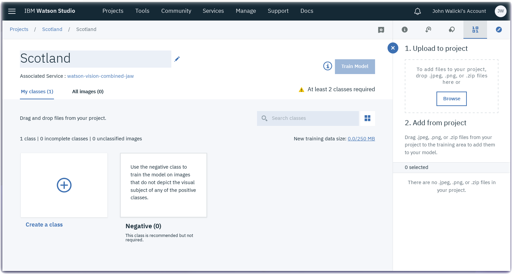

#### Add Custom Classes to the Watson Visual Recognition Model
- Click on the **+** symbol to add a class

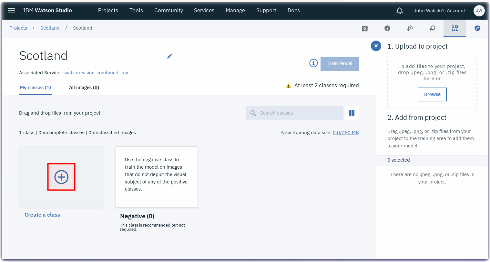

- Name this class **Castle**
- Click the **Create** button

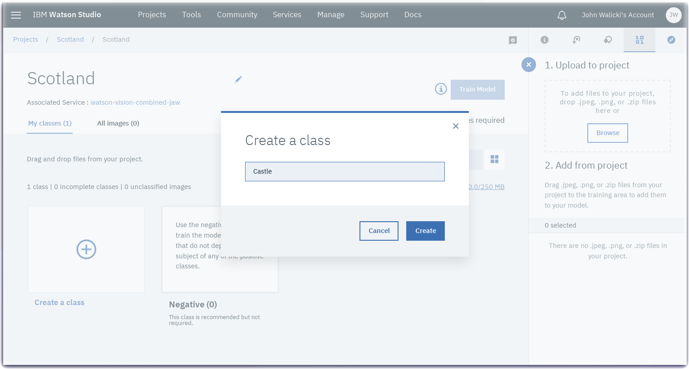

- Add a second custom class by clicking on the **+** symbol again

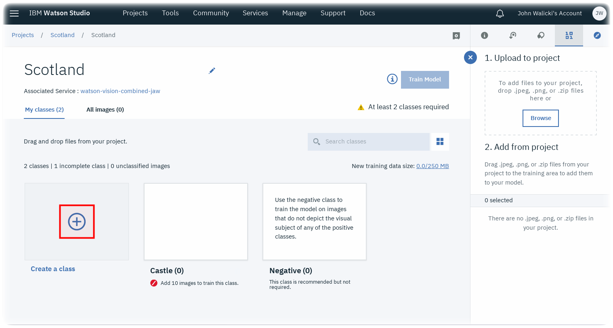

- Name this class **Black House**
- Click the **Create** button

#### Upload Zip Files to Watson Studio Project
- Three zip files have been prepared which contain aerial drone images
- These zip files are on the local lab workstation
- If you following these steps on the web, download the aerial drone zip files here:
  - [Castles.zip](classes/Castles.zip)
  - [BlackHouses.zip](classes/BlackHouses.zip)
  - [Countryside.zip](classes/Countryside.zip)
- Click on the **Browse** button
- An operating system native File Dialog will open
- Multi-select the three zip files **Castles.zip**, **BlackHouses.zip**, **Countryside.zip**
- Upload these zip files to your Watson Studio project

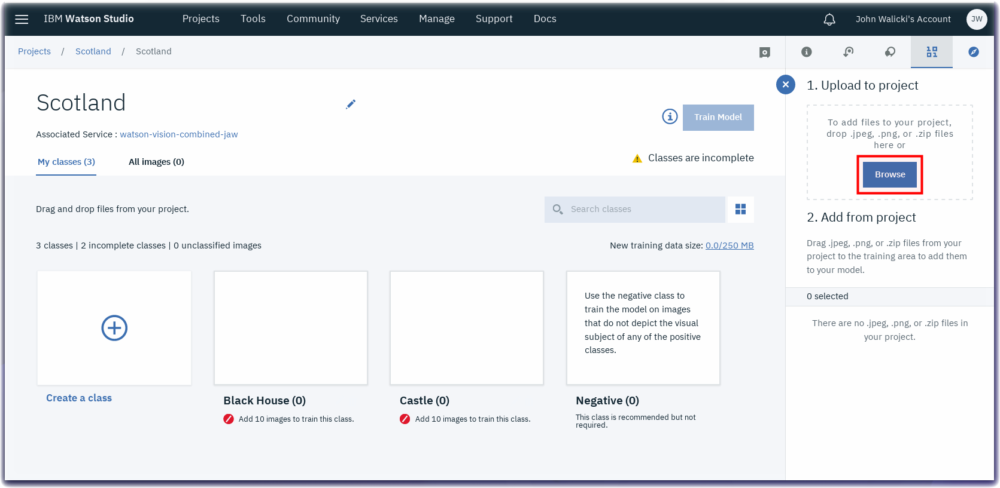

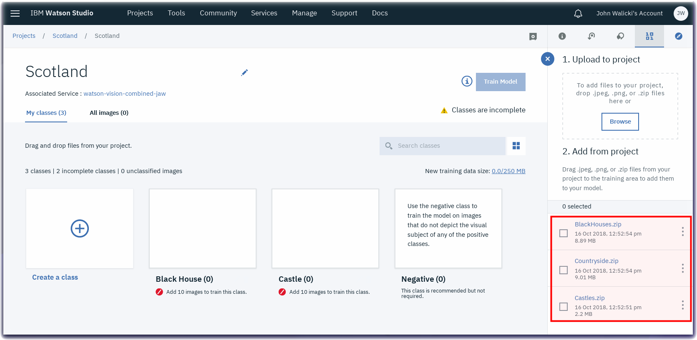

#### Drag the zip files to Custom Classes
- Grab the **BlackHouses.zip** from the right navigation and drag it to the **Black House** class

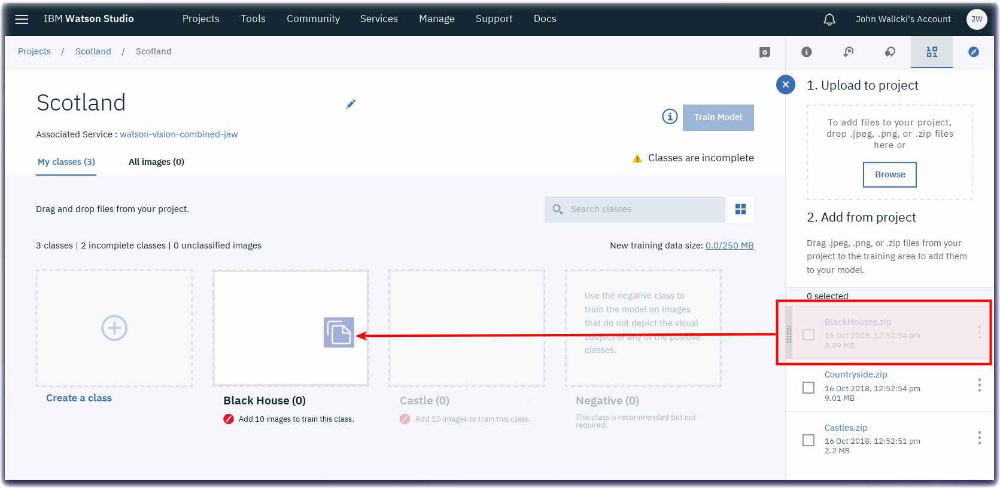

- The images in the zip file will be added to the **Black House** class

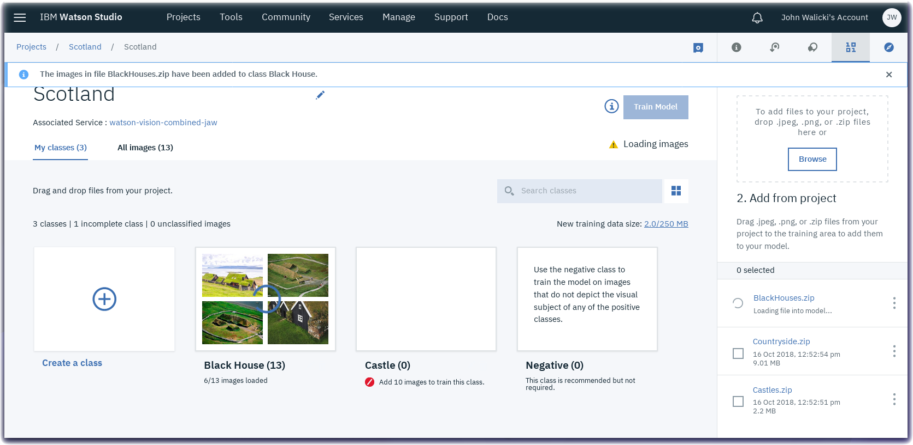

- Grab the **Castles.zip** from the right navigation and drag it to the **Castle** class

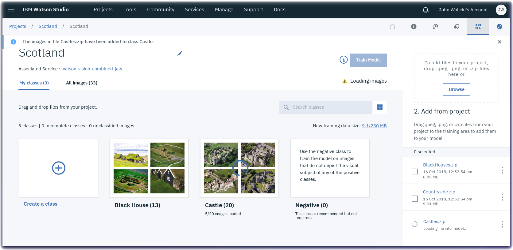

- Grab the **Countryside.zip** from the right navigation and drag it to the **Negative** class

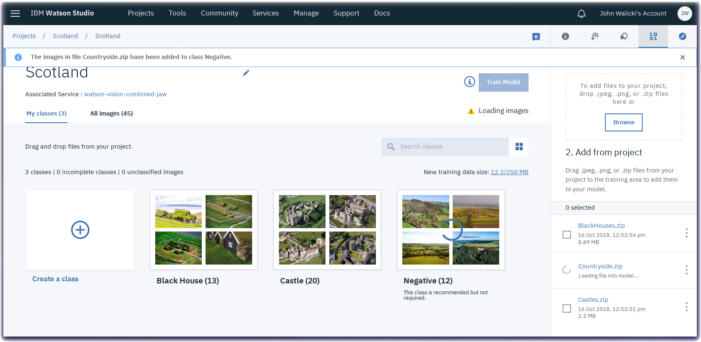

#### Train your Watson Visual Recognition Custom Classifier
- Click on the **Train Model** button
- Wait a few minutes for the model to train on the images

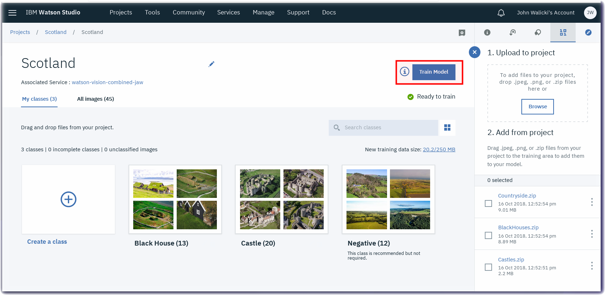

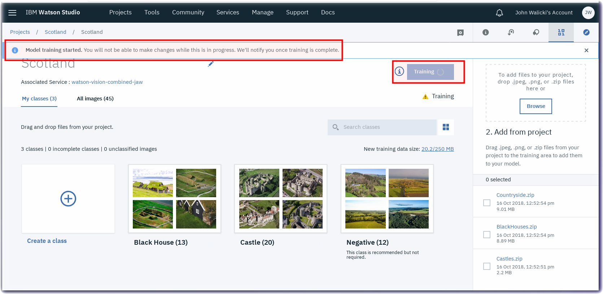

#### Congratulations
- Once the model has been trained, click on the **Click here** link to view and test your model.

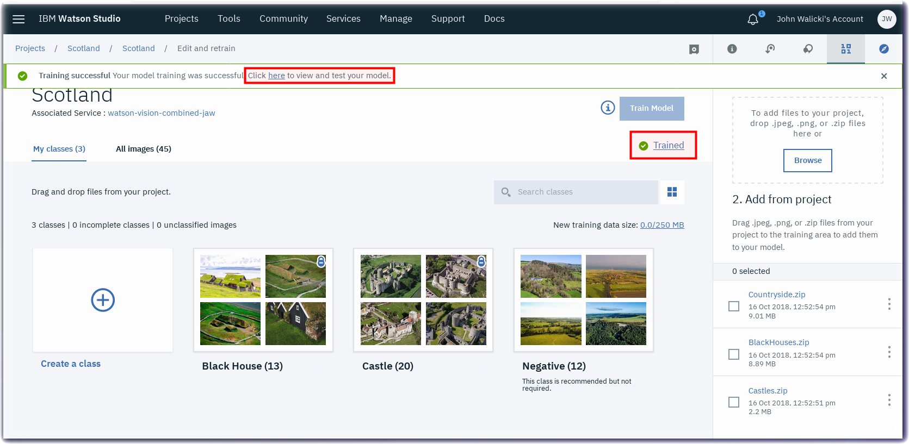

#### Review and Test
- Review the Classes and Model details
- Click on the **Test** tab

Test your model in the next [step](VRMTEST.md)

*Quick links :*
[Home](README.md) - [Scotland](SCOTLAND.md) - [Watson Studio](STUDIO.md) - [**Visual Recognition Model**](VISRECO.md) - [Test and Deploy](VRMTEST.md)
